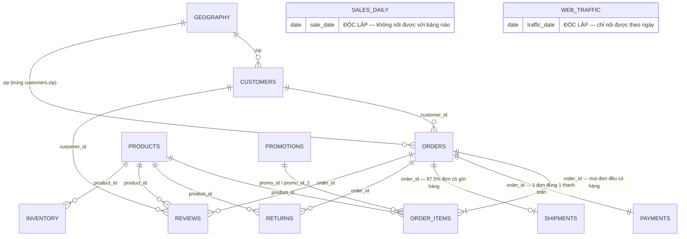
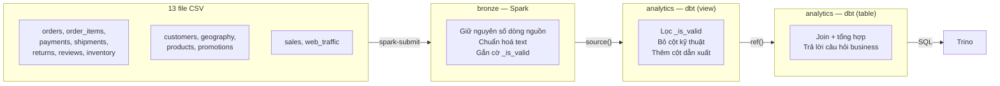
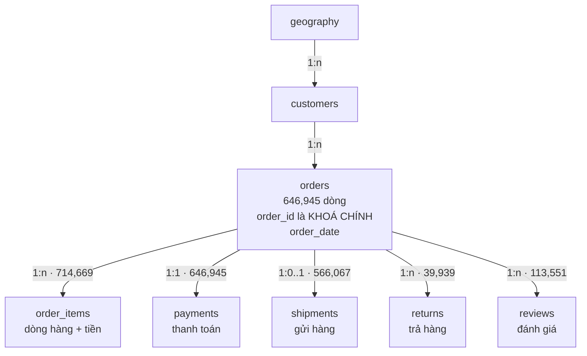

# Mô hình dữ liệu — 13 bảng bronze

Tài liệu này mô tả **các bảng nối với nhau thế nào** và **join sao cho đúng**. Mọi con số ở
đây đều lấy từ dữ liệu thật trong catalog, không phải suy đoán từ tên cột — cách kiểm chứng
lại nằm ở [mục cuối](#tự-kiểm-chứng-lại).

Xem thêm: [Thêm một bảng mới vào pipeline](them-bang-moi.md) cho cách viết job.

## Mục lục

- [Sơ đồ quan hệ](#sơ-đồ-quan-hệ)
- [Ba nhóm bảng](#ba-nhóm-bảng)
- [orders — bảng trung tâm](#orders--bảng-trung-tâm)
- [Lực lượng quan hệ](#lực-lượng-quan-hệ-cardinality)
- [Cột trùng lặp giữa các bảng](#cột-trùng-lặp-giữa-các-bảng)
- [Hai bảng không nối được với ai](#hai-bảng-không-nối-được-với-ai)
- [Trục thời gian](#trục-thời-gian)
- [Bất thường đã phát hiện](#bất-thường-đã-phát-hiện)
- [Công thức join](#công-thức-join)
- [Tự kiểm chứng lại](#tự-kiểm-chứng-lại)

---

## Sơ đồ quan hệ



Ký hiệu: `||--o{` = một-nhiều (phía nhiều **có thể** rỗng) · `||--|{` = một-nhiều (phía nhiều
**bắt buộc** có ít nhất 1) · `||--||` = một-một · `||--o|` = một-không-hoặc-một.

Luồng dữ liệu qua các layer:



---

## Ba nhóm bảng

Phân loại này quyết định cách bạn join và cách bạn partition.

### Fact — ghi lại sự kiện đã xảy ra

Có nhiều dòng, gắn với thời điểm, và **khoá không unique** (trừ `orders`/`payments`).

| Bảng | Dòng | Hạt (grain) — mỗi dòng là gì |
|---|---:|---|
| `orders` | 646,945 | một đơn hàng |
| `order_items` | 714,669 | một **dòng hàng** trong đơn |
| `payments` | 646,945 | một lần thanh toán |
| `shipments` | 566,067 | một lần gửi hàng |
| `reviews` | 113,551 | một đánh giá |
| `returns` | 39,939 | một **lần trả** (`return_id` là khoá chính, unique) |
| `inventory` | 60,247 | tồn kho của **1 sản phẩm trong 1 tháng** |

**Hạt là khái niệm quan trọng nhất khi join.** Nhầm hạt là nguồn gốc của gần như mọi số sai:
join `orders` với `order_items` rồi `count(*)` cho ra số *dòng hàng*, không phải số *đơn*.

Hai chỗ hạt **không** phải như tên gọi gợi ý — cả hai đều đã kiểm chứng trên dữ liệu thật:

- **`order_items` không phải "một sản phẩm trong một đơn"**: có 16 cặp `(order_id, product_id)`
  xuất hiện trên nhiều dòng của cùng một đơn. Muốn "mỗi sản phẩm một dòng" thì phải `group by`.
- **`returns` không phải "một sản phẩm bị trả"** mà là "một *lần* trả": cùng một sản phẩm của
  cùng một đơn có thể bị trả 2 lần vào 2 ngày khác nhau (2 cặp như vậy).

Hệ quả trực tiếp: [join `returns` với `order_items` phải gộp trước](#tỷ-lệ-trả-hàng-theo-sản-phẩm--gộp-trước-join-sau).

### Dimension — mô tả thuộc tính, ít đổi

| Bảng | Dòng | Khoá |
|---|---:|---|
| `customers` | 121,930 | `customer_id` |
| `geography` | 39,948 | `zip` |
| `products` | 2,412 | `product_id` |
| `promotions` | 50 | `promo_id` |

### Độc lập — không có khoá ngoại

| Bảng | Dòng | Ghi chú |
|---|---:|---|
| `sales_daily` | 3,833 | doanh thu ngày tổng hợp sẵn |
| `web_traffic` | 3,652 | lưu lượng web theo ngày |

Xem [Hai bảng không nối được với ai](#hai-bảng-không-nối-được-với-ai).

---

## orders — bảng trung tâm

`orders` là **hub**: 5 trong 7 bảng fact nối về nó qua `order_id`. Muốn biết bất kỳ sự kiện
nào xảy ra *ngày nào*, bạn phải đi qua `orders`, vì chỉ nó có `order_date`.



**Hệ quả thực tế:** `order_items` không có cột ngày. Muốn tính doanh thu theo ngày, bắt buộc
join với `orders` — đó chính là điều `gold_revenue_daily` làm.

`orders.order_status` có 6 giá trị, và nó **quyết định các bảng khác có dòng tương ứng hay không**:

| Trạng thái | Số đơn | Có shipment? |
|---|---:|---|
| `delivered` | 516,716 | có (trừ 524 đơn — xem [bất thường](#bất-thường-đã-phát-hiện)) |
| `cancelled` | 59,462 | **không** — đơn huỷ thì không gửi hàng |
| `returned` | 36,142 | có (trừ 29 đơn) |
| `shipped` | 13,773 | có (trừ 11 đơn) |
| `paid` | 13,577 | **không** — đã trả tiền, chưa gửi |
| `created` | 7,275 | **không** — mới tạo |

---

## Lực lượng quan hệ (cardinality)

Đây là bảng quan trọng nhất của tài liệu: **nó quyết định `join` hay `left join`, và khi nào
`count(*)` cho ra số sai.**

| Từ | Tới | Lực lượng | Kiểm chứng thật |
|---|---|---|---|
| `orders` | `payments` | **1 : 1** | 646,945 dòng / 646,945 `order_id` distinct — mọi đơn đúng 1 thanh toán |
| `orders` | `order_items` | **1 : n (n ≥ 1)** | 714,669 dòng / 646,945 distinct — **mọi đơn đều có ít nhất 1 dòng hàng**, trung bình 1.10 |
| `orders` | `shipments` | **1 : 0..1** | 566,067 dòng / 566,067 distinct — 80,878 đơn (12.5%) **không có** shipment |
| `orders` | `reviews` | **1 : 0..n** | 113,551 dòng / 111,369 distinct — 17.2% đơn có đánh giá; vài đơn có nhiều |
| `orders` | `returns` | **1 : 0..n** | 39,939 dòng / 36,062 distinct — vài đơn trả nhiều sản phẩm |
| `customers` | `orders` | 1 : 0..n | 121,930 khách |
| `products` | `order_items` | 1 : 0..n | 2,412 sản phẩm |
| `promotions` | `order_items` | 1 : 0..n | 276,316 dòng hàng (38.7%) có promo |

Ba điều rút ra:

- **`orders` ⋈ `payments` là an toàn nhất.** 1:1 nên `join` không nhân dòng, không mất dòng.
- **`orders` ⋈ `order_items` an toàn về phía đơn** (mọi đơn đều có hàng, nên inner join không
  mất đơn nào) **nhưng nhân dòng**: sau join, một đơn 3 sản phẩm thành 3 dòng. Luôn dùng
  `count(distinct order_id)` để đếm đơn.
- **`orders` ⋈ `shipments` bắt buộc `left join`** nếu bạn muốn giữ đủ đơn. Inner join sẽ âm
  thầm vứt 80,878 đơn huỷ/chưa gửi — và nếu bạn đang tính doanh thu, con số sẽ hụt 12.5%.

> **Toàn bộ 14 khoá ngoại đều sạch: 0 dòng mồ côi.** Không có `order_items` nào trỏ tới đơn
> không tồn tại, không có `orders` nào trỏ tới khách không tồn tại. Nên mọi mất mát dòng khi
> join đều đến từ **lực lượng** (đơn không có shipment), không phải từ dữ liệu hỏng.

---

## Cột trùng lặp giữa các bảng

Nguồn đã phi chuẩn hoá sẵn ở vài chỗ. **Cả hai trường hợp dưới đây trùng khớp 100%** trên
toàn bộ 646,945 đơn:

| Cột | Trùng với | Kiểm chứng |
|---|---|---|
| `orders.zip` | `customers.zip` của chính khách đó | 646,945/646,945 khớp, 0 lệch |
| `orders.payment_method` | `payments.payment_method` của chính đơn đó | 646,945/646,945 khớp, 0 lệch |

**Tại sao điều này quan trọng?** Vì bạn **không cần join** để lấy chúng:

```sql
-- KHÔNG cần join sang customers chỉ để lấy zip
SELECT o.order_id, c.zip FROM orders o JOIN customers c ON o.customer_id = c.customer_id;

-- Dùng thẳng cột có sẵn — nhanh hơn nhiều
SELECT order_id, zip FROM orders;
```

`inventory` cũng phi chuẩn hoá `product_name`, `category`, `segment` từ `products`, và có sẵn
cột dẫn xuất `year`, `month` từ `snapshot_date`.

> **Cẩn thận:** trùng khớp *hôm nay* không đảm bảo trùng khớp *mãi mãi*. Nếu khách chuyển nhà,
> `customers.zip` đổi nhưng `orders.zip` của đơn cũ thì không — và đó mới là hành vi **đúng**
> (đơn cũ giao tới địa chỉ cũ). Khi hai cột lệch nhau trong tương lai, hãy hiểu là *snapshot
> lịch sử*, đừng vội coi là lỗi. Chọn cột nào tuỳ câu hỏi: "đơn này giao đi đâu" → `orders.zip`;
> "khách này hiện ở đâu" → `customers.zip`.

`promotions.applicable_category` rỗng ở **40/50 dòng** — nghĩa là "áp dụng mọi category",
không phải thiếu dữ liệu. Job bronze đã quy nó về `NULL`.

---

## Hai bảng không nối được với ai

`sales_daily` và `web_traffic` **không có khoá ngoại nào**. Chỉ nối được với phần còn lại
**theo ngày**, mà nối theo ngày thì không phải quan hệ khoá — nó là ghép hai chuỗi thời gian.

### sales_daily — đừng dùng thay cho order_items

Đây là doanh thu ngày do nguồn tổng hợp sẵn (3,833 ngày, mỗi ngày 1 dòng), **và nó không
khớp với số tính từ `order_items`**:

| Ngày | `sales_daily.revenue` | Tính từ `order_items` | Lệch |
|---|---:|---:|---:|
| 2022-12-31 | 2,383,037.48 | 2,015,982.03 | +367,055 (+18%) |

Cả hai có cùng số dòng (3,833) và cùng khoảng ngày (2012-07-04 → 2022-12-31), nên đây không
phải chuyện thiếu dữ liệu. Chênh lệch có thể do `sales_daily` cộng thêm phí ship, thuế, hoặc
tính theo công thức khác.

**Đây là hai nguồn số độc lập, không phải một nguồn đúng và một nguồn sai.** Đừng sửa query
cho khớp — hãy điều tra rồi ghi lại kết luận. Chọn nguồn nào tuỳ mục đích: cần bóc tách theo
sản phẩm/khách → `order_items`; cần con số "chính thức" của nguồn → `sales_daily`.

`sales_daily` còn có cột `_margin_negative`: **382/3,833 ngày (10%) bán lỗ** (`cogs > revenue`).
Đó là sự thật kinh doanh chứ không phải lỗi, nên job bronze không gắn cờ `_is_valid = false`
cho chúng.

### web_traffic — hạt khác với orders

Mỗi dòng là **1 ngày × 1 nguồn traffic**. Muốn nối với `orders` phải tổng hợp trước:

```sql
SELECT w.traffic_date, sum(w.sessions) AS sessions, count(DISTINCT o.order_id) AS orders
FROM bronze.web_traffic w
LEFT JOIN bronze.orders o ON o.order_date = w.traffic_date
GROUP BY w.traffic_date;
```

**Bẫy:** `web_traffic` có nhiều dòng cùng ngày (một dòng mỗi nguồn traffic). Join thẳng với
`orders` theo ngày sẽ nhân bản đơn hàng lên nhiều lần. Phải `group by` một trong hai phía trước.

`web_traffic.traffic_source` và `customers.acquisition_channel` có **cùng 6 giá trị**
(direct, email_campaign, organic_search, paid_search, referral, social_media) — hấp dẫn để
join, nhưng chúng đo hai thứ khác nhau: một bên là phiên truy cập, một bên là kênh thu hút
khách lúc đăng ký. Nối chúng lại là so sánh khập khiễng.

---

## Trục thời gian

```
2012-01   2012-07        2013-01                                    2022-12   2023-01    2024-07
   │         │              │                                          │         │          │
   ├─────────┤              │                                          │         │          │
   │ customers.signup_date (2012-01-17 → 2022-12-31)                   │         │          │
             ├──────────────────────────────────────────────────────────┤         │          │
             │ orders / order_items / payments / sales_daily (2012-07-04 → 2022-12-31)      │
             ├──────────────────────────────────────────────────────────┤         │          │
             │ shipments (2012-07-04 → 2022-12-29)  returns  reviews  inventory   │          │
                            ├─────────────────────────────────────────────┤         │          │
                            │ web_traffic (2013-01-01 → 2022-12-31)       │         │          │
                            ├─────────────────────────────────────────────┤         │          │
                            │ promotions (2013-01-31 → 2022-12-31)        │         │          │
                                                                          ├──────────────────┤
                                                                          │ sample_submission │
                                                                          │ (KHÔNG ingest)    │
```

Ba điều đáng chú ý:

- **`web_traffic` thiếu 6 tháng đầu** (bắt đầu 2013-01-01 trong khi đơn hàng có từ 2012-07-04).
  Join theo ngày sẽ ra `NULL` cho nửa cuối 2012 — dùng `left join` từ phía `orders` và đừng
  hoảng khi thấy khoảng trống đó.
- **`customers` bắt đầu sớm hơn `orders` 6 tháng** — hợp lý, khách đăng ký trước khi mua.
- **Mọi bảng dừng ở 2022-12-31.** `sample_submission.csv` (2023-01-01 → 2024-07-01) là khung
  nộp kết quả dự báo, **không được ingest** vì nó không phải dữ liệu thật.

---

## Bất thường đã phát hiện

Những thứ này **rule chất lượng ở bronze không thể bắt được**, vì job bronze xử lý từng bảng
độc lập — nó không biết bảng kia có gì. Chỉ khi cả hai bảng cùng vào SQL mới kiểm tra chéo được.

### 564 đơn đã giao nhưng không có bản ghi shipment

| Trạng thái | Số đơn không có shipment | Có hợp lý không? |
|---|---:|---|
| `cancelled` | 59,462 | ✅ đơn huỷ thì không gửi |
| `paid` | 13,577 | ✅ đã trả tiền, chưa gửi |
| `created` | 7,275 | ✅ mới tạo |
| **`delivered`** | **524** | ❌ **đã giao mà không có lần gửi nào?** |
| **`returned`** | **29** | ❌ đã trả hàng thì phải từng được giao |
| **`shipped`** | **11** | ❌ mâu thuẫn ngay trong tên trạng thái |

80,314 đơn đầu là **lực lượng bình thường**. 564 đơn sau là **mâu thuẫn logic thật** — chiếm
0.09%, đủ nhỏ để là lỗi dữ liệu thật chứ không phải hiện tượng có hệ thống.

Ảnh hưởng thực tế: báo cáo "tỷ lệ giao hàng đúng hạn" tính từ `shipments` sẽ bỏ sót 564 đơn
này. Nhỏ, nhưng nên biết mà trừ hao.

Tìm lại chúng:

```sql
SELECT o.order_id, o.order_date, o.order_status
FROM bronze.orders o
LEFT JOIN bronze.shipments s ON o.order_id = s.order_id
WHERE s.order_id IS NULL AND o.order_status IN ('delivered', 'returned', 'shipped');
```

### promo_id_2 — không phải lỗi, nhưng dễ hiểu nhầm

206/714,669 dòng hàng (0.03%) có khuyến mãi thứ hai. Mẫu hình **hoàn toàn nhất quán**:

| promo_id (thứ 1) | stackable | promo_id_2 (thứ 2) | stackable | Số dòng |
|---|---:|---|---:|---:|
| PROMO-0013 | 1 | PROMO-0015 | 0 | 132 |
| PROMO-0023 | 1 | PROMO-0025 | 0 | 74 |

Promo thứ nhất **luôn** có `stackable_flag = 1`, promo thứ hai **luôn** có `= 0`. Cách hiểu
hợp lý: cờ này gác việc *"có được cộng thêm khuyến mãi nữa lên trên không"*, nên promo thứ hai
mang cờ 0 là đúng — nó là mắt xích cuối, không cho cộng thêm nữa.

**Đừng viết rule chặn `stackable_flag = 0` ở vị trí thứ hai** — bạn sẽ gắn cờ lỗi cho 206
dòng hoàn toàn hợp lệ.

### discount_amount nhất quán tuyệt đối với promo

276,316 dòng hàng có `promo_id`, và **đúng 276,316 dòng** có `discount_amount > 0`. Không có
dòng nào giảm giá mà thiếu promo, cũng không có promo nào mà không giảm giá. Đây là dấu hiệu
dữ liệu được sinh ra nhất quán — và cũng là một ràng buộc đáng viết test ở silver.

### Số trả hàng luôn nằm trong số đã mua

Kiểm tra trên toàn bộ **39,937 cặp (đơn, sản phẩm) có trả hàng: 0 cặp trả nhiều hơn mua.**
Ràng buộc quan trọng này được giữ tuyệt đối — nhưng chỉ thấy được khi gộp đúng hạt ở cả hai
phía. Xem [bài học về chính tài liệu này](#một-bài-học-về-chính-tài-liệu-này) để biết vì sao
query sai hạt lại báo có 3 cặp vi phạm.

### Tất cả rule bronze đều bắt được 0 dòng

Trên cả 13 bảng, `_is_valid = false` không có dòng nào. Dữ liệu này sạch tuyệt đối.

**Hệ quả cần nhớ:** một bộ rule không bắt được gì thì *không phân biệt được* với việc không có
rule nào. Các rule hiện tại là **lưới an toàn cho dữ liệu tương lai**, chưa phải bằng chứng
rằng chúng hoạt động. Kiểm chứng chéo (như query 564 đơn ở trên) mới là thứ đang thực sự tìm
ra vấn đề.

---

## Công thức join

### Doanh thu theo ngày

`order_items` có tiền nhưng không có ngày; `orders` có ngày. Bắt buộc join.

```sql
SELECT o.order_date,
       count(DISTINCT o.order_id) AS num_orders,   -- KHÔNG dùng count(*)
       sum(i.quantity * i.unit_price - i.discount_amount) AS revenue
FROM bronze.order_items i
JOIN bronze.orders o ON i.order_id = o.order_id
WHERE i._is_valid AND o._is_valid
GROUP BY o.order_date;
```

Inner join an toàn ở đây vì mọi đơn đều có ít nhất 1 dòng hàng (đã kiểm chứng).

### Doanh thu theo category sản phẩm

Đi qua 3 bảng: `orders` (ngày) → `order_items` (tiền) → `products` (category).

```sql
SELECT p.category, sum(i.quantity * i.unit_price - i.discount_amount) AS revenue
FROM bronze.order_items i
JOIN bronze.orders o   ON i.order_id = o.order_id
JOIN bronze.products p ON i.product_id = p.product_id
WHERE o.order_date >= DATE '2022-01-01'
GROUP BY p.category ORDER BY revenue DESC;
```

### Doanh thu theo vùng

`orders.zip` dùng thẳng được — **không cần** join qua `customers` (hai cột trùng 100%).

```sql
SELECT g.region, count(DISTINCT o.order_id) AS num_orders
FROM bronze.orders o
JOIN bronze.geography g ON o.zip = g.zip
GROUP BY g.region;
```

### Tỷ lệ giao hàng — phải left join

```sql
SELECT o.order_status,
       count(*) AS num_orders,
       count(s.order_id) AS co_shipment,          -- count(cột) bỏ qua NULL
       avg(date_diff('day', s.ship_date, s.delivery_date)) AS ngay_giao_tb
FROM bronze.orders o
LEFT JOIN bronze.shipments s ON o.order_id = s.order_id   -- LEFT: giữ đơn chưa gửi
GROUP BY o.order_status;
```

Dùng `join` thường ở đây sẽ vứt 80,878 đơn và bảng kết quả mất hẳn dòng `cancelled`.

### Tỷ lệ trả hàng theo sản phẩm — gộp trước, join sau

Đây là join **khó nhất** trong repo, vì cả hai phía đều có `(order_id, product_id)` lặp lại:

- `order_items`: **16 cặp** trùng — cùng sản phẩm nằm trên nhiều dòng của một đơn.
- `returns`: **2 cặp** trùng — cùng sản phẩm của cùng đơn bị trả **2 lần vào 2 ngày khác nhau**
  (ví dụ đơn 397622: trả 5 cái ngày 2016-06-13, trả tiếp 6 cái ngày 2016-06-21).

Join trực tiếp hai bảng này sẽ nhân dòng ở **cả hai phía**. Cách đúng là **gộp mỗi phía về
đúng hạt trước, rồi mới join**:

```sql
WITH mua AS (
    SELECT order_id, product_id, sum(quantity) AS da_mua
    FROM bronze.order_items GROUP BY 1, 2
),
tra AS (
    SELECT order_id, product_id, sum(return_quantity) AS da_tra
    FROM bronze.returns GROUP BY 1, 2
)
SELECT p.product_name,
       sum(m.da_mua)                AS da_ban,
       coalesce(sum(t.da_tra), 0)   AS da_tra
FROM mua m
JOIN bronze.products p ON m.product_id = p.product_id
LEFT JOIN tra t ON t.order_id = m.order_id AND t.product_id = m.product_id
GROUP BY p.product_name;
```

**Bằng chứng cho việc nhân dòng** — `order_items` gốc có 714,669 dòng:

| Cách join `returns` | Số dòng sau join | Dôi ra |
|---|---:|---:|
| Chỉ bằng `order_id` | 722,575 | **+7,906** |
| Bằng `(order_id, product_id)` | 714,673 | +4 |
| Gộp trước rồi join | 714,669 | 0 ✅ |

### Ba lỗi join hay gặp nhất

| Lỗi | Hậu quả | Cách tránh |
|---|---|---|
| `count(*)` sau khi join `order_items` | Đếm dòng hàng thành số đơn → phóng đại ~10% | `count(distinct order_id)` |
| `join` thay vì `left join` với `shipments` | Mất 80,878 đơn (12.5%) | `left join` khi phía kia là 0..1 |
| Join `returns` với `order_items` trực tiếp | Nhân dòng ở cả hai phía | Gộp mỗi phía về đúng hạt trước khi join |

### Một bài học về chính tài liệu này

Lần đầu kiểm tra "có ai trả hàng nhiều hơn số đã mua không", mình chạy query gộp `order_items`
theo `(order_id, product_id, quantity)` và nó báo **3 cặp vi phạm** — nghe rất giống một phát
hiện hay. Nhưng query đó **sai**: vì gộp lẫn cả `quantity` vào khoá, nó tách một sản phẩm nằm
trên 2 dòng thành 2 nhóm riêng, mỗi nhóm chỉ thấy một phần số lượng đã mua, nên số trả trông
như vượt quá.

Gộp đúng thì kết quả là **0 vi phạm**:

```sql
WITH mua AS (SELECT order_id, product_id, sum(quantity) AS da_mua FROM bronze.order_items GROUP BY 1,2),
     tra AS (SELECT order_id, product_id, sum(return_quantity) AS da_tra FROM bronze.returns GROUP BY 1,2)
SELECT count_if(t.da_tra > m.da_mua) AS tra_nhieu_hon_mua
FROM tra t JOIN mua m ON t.order_id = m.order_id AND t.product_id = m.product_id;
-- 0 trên 39,937 cặp
```

**Bài học:** một "bất thường" tìm được bằng query sai hạt trông y hệt một bất thường thật.
Trước khi báo động, hãy kiểm tra query của mình có gộp đúng hạt chưa — sai hạt là cách phổ
biến nhất để **tạo ra** lỗi thay vì tìm ra lỗi.

---

## Tự kiểm chứng lại

Đừng tin bảng số ở trên — dữ liệu có thể đã đổi từ lúc viết. Chạy lại:

**Kiểm tra một khoá ngoại có mồ côi không:**

```sql
SELECT count(*) FROM bronze.order_items c
LEFT JOIN bronze.orders p ON c.order_id = p.order_id
WHERE p.order_id IS NULL;     -- 0 = sạch
```

**Xác định lực lượng của một quan hệ:**

```sql
SELECT count(*) AS dong, count(DISTINCT order_id) AS distinct_khoa
FROM bronze.order_items;
-- dòng = distinct  -> 1:1
-- dòng > distinct  -> 1:n  (join sẽ nhân dòng!)
```

**Kiểm tra hai bảng có phủ nhau hoàn toàn không:**

```sql
SELECT count_if(s.order_id IS NULL) AS don_thieu_shipment
FROM bronze.orders o LEFT JOIN bronze.shipments s ON o.order_id = s.order_id;
-- > 0  -> phải dùng LEFT JOIN
```

**Kiểm tra hai cột có thực sự trùng nhau không** (trước khi bỏ một join):

```sql
SELECT count_if(o.zip <> c.zip) AS so_dong_lech
FROM bronze.orders o JOIN bronze.customers c ON o.customer_id = c.customer_id;
-- 0 -> dùng thẳng orders.zip được
```
