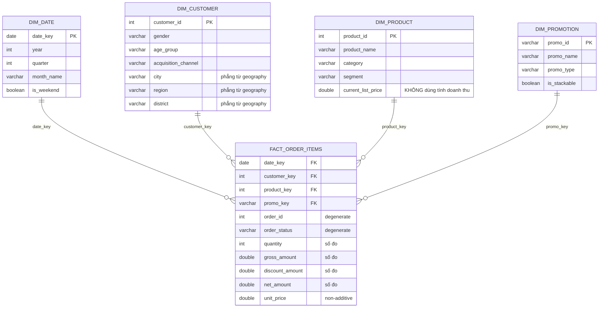

# Star schema — thiết kế và lý do

Tài liệu này giải thích star schema trong `models/gold/`: **mỗi bảng để làm gì, mỗi quyết định
vì sao chọn thế**. Mọi con số đều lấy từ dữ liệu thật.

Xem thêm: [Mô hình dữ liệu](mo-hinh-du-lieu.md) (quan hệ 13 bảng bronze) ·
[Thêm bảng mới](them-bang-moi.md) (cách viết job/model).

## Mục lục

- [Star schema là gì và giải quyết vấn đề gì](#star-schema-là-gì-và-giải-quyết-vấn-đề-gì)
- [Sơ đồ](#sơ-đồ)
- [Hạt — quyết định quan trọng nhất](#hạt--quyết-định-quan-trọng-nhất)
- [Fact chứa gì](#fact-chứa-gì)
- [Dimension chứa gì](#dimension-chứa-gì)
- [Năm quyết định thiết kế](#năm-quyết-định-thiết-kế)
- [Query mẫu](#query-mẫu)
- [Hạn chế đã biết](#hạn-chế-đã-biết)
- [Mở rộng tiếp](#mở-rộng-tiếp)

---

## Star schema là gì và giải quyết vấn đề gì

**Vấn đề:** dữ liệu nguồn được chuẩn hoá để *ghi* cho nhanh và không trùng lặp. Nhưng phân
tích thì *đọc* là chính, và chuẩn hoá làm việc đọc khổ sở — muốn biết "doanh thu theo vùng"
bạn phải đi `order_items → orders → customers → geography`, bốn bảng cho một câu hỏi đơn giản.

**Giải pháp:** tổ chức lại thành **một bảng fact ở giữa, các dimension vây quanh** — nhìn như
ngôi sao, nên gọi là star schema. Mọi câu hỏi đều có dạng: *"số đo nào" (fact) nhóm theo
"thuộc tính nào" (dimension)*.

| | Fact | Dimension |
|---|---|---|
| Chứa gì | Số đo cộng được | Thuộc tính mô tả để lọc/nhóm |
| Số dòng | Rất nhiều (714.669) | Ít (51 → 121.930) |
| Tăng theo | Thời gian | Gần như không tăng |
| Trả lời | "Bao nhiêu?" | "Theo cái gì?" |
| Ví dụ | `net_amount`, `quantity` | `region`, `category`, `year` |

Câu thần chú: **fact là động từ, dimension là trạng từ.** "Bán được bao nhiêu tiền *(fact)*,
ở vùng nào *(dim)*, tháng nào *(dim)*, loại sản phẩm gì *(dim)*."

---

## Sơ đồ



Số dòng thật sau khi build:

| Bảng | Dòng | Ghi chú |
|---|---:|---|
| `fact_order_items` | 714.669 | khớp chính xác `silver_order_items` |
| `dim_customer` | 121.930 | |
| `dim_date` | 4.018 | tự sinh, 2012-01-01 → 2022-12-31 |
| `dim_product` | 2.412 | |
| `dim_promotion` | **51** | 50 thật + 1 nhân tạo `NO_PROMO` |

---

## Hạt — quyết định quan trọng nhất

**Hạt (grain) = một dòng trong fact nghĩa là gì.** Đây là câu đầu tiên phải trả lời, trước cả
việc chọn cột.

`fact_order_items` có hạt: **một dòng = một dòng hàng trong một đơn.**

Từ đó suy ra mọi thứ khác:

- Cột nào cũng phải đúng với hạt đó. Không được nhét "tổng tiền cả đơn" vào — đó là hạt *đơn*,
  không phải hạt *dòng hàng*. Nhét vào thì `sum()` sẽ cộng lặp.
- Số dòng fact **phải bằng** số dòng `silver_order_items`. Lệch = join đã nhân dòng hoặc làm
  mất dòng.

Điều đó được canh bằng test riêng — `tests/assert_fact_order_items_grain.sql`:

```sql
with fact as (select count(*) as n from {{ ref('fact_order_items') }}),
silver as (select count(*) as n from {{ ref('silver_order_items') }})
select fact.n, silver.n from fact cross join silver where fact.n <> silver.n
```

**Tại sao test này quan trọng nhất bảng?** Vì join nhân dòng là lỗi *im lặng*: bảng vẫn build,
mọi test cột vẫn PASS, chỉ có doanh thu bị thổi phồng. Không có test hạt thì không ai biết.

> Viết tay thay vì dùng `dbt_utils.equal_rowcount` vì macro đó sinh ra `group by <alias>` —
> cú pháp Postgres mà **Trino không hỗ trợ**. Đây là lỗi tương thích của package, không phải
> lỗi thiết kế.

---

## Fact chứa gì

Fact chứa đúng **3 loại cột**, không gì khác:

### 1. Khoá ngoại (`_key`)

```sql
o.order_date                      as date_key,
o.customer_id                     as customer_key,
i.product_id                      as product_key,
coalesce(i.promo_id, 'NO_PROMO')  as promo_key,
```

Trỏ tới dimension. **Không cột nào được NULL** — xem [quyết định 3](#3-thành-viên-nhân-tạo-no_promo).

### 2. Degenerate dimension

Khoá nghiệp vụ hoặc thuộc tính **không đáng làm dimension riêng**:

```sql
i.order_id,          -- khoá nghiệp vụ, mọi thuộc tính đã sang dim khác
o.order_status,      -- chỉ 6 giá trị
o.payment_method,    -- chỉ 5 giá trị
o.device_type,
o.order_source,
```

**Tại sao `order_id` không thành `dim_order`?** Vì sau khi `order_date` sang `dim_date` và
`customer_id` sang `dim_customer`, bảng `orders` **không còn thuộc tính nào** để mô tả. Một
dimension chỉ có mỗi khoá là dimension rỗng — vô dụng. Nên `order_id` ở lại fact, gọi là
*degenerate* (dimension bị thoái hoá thành mỗi cái khoá).

Nó vẫn dùng được: `count(distinct order_id)` để đếm đơn, và truy ngược về hệ thống nguồn.

**Tại sao `order_status` không thành dimension?** Sách Kimball gọi cách gom các cột ít giá trị
lại là *junk dimension*. Ở quy mô này (4 cột, mỗi cột 4-6 giá trị), làm 4 dimension tí hon là
thừa — để thẳng trên fact đơn giản hơn và không mất gì.

### 3. Số đo (measures)

```sql
i.quantity,
i.quantity * i.unit_price   as gross_amount,   -- trước giảm giá
i.discount_amount,                             -- tiền giảm
i.line_amount               as net_amount,     -- doanh thu thật
i.unit_price                                   -- NON-ADDITIVE
```

**Additive** nghĩa là cộng được theo *mọi* dimension. `net_amount` cộng theo ngày ra doanh thu
ngày, cộng theo vùng ra doanh thu vùng, cộng theo cả hai vẫn đúng. **Đây là loại số đo tốt
nhất, và là lý do star schema hoạt động.**

`unit_price` thì **non-additive**: cộng giá đơn vị của hai dòng hàng lại ra con số vô nghĩa.
Giữ lại vì cần cho `avg(unit_price)`, nhưng đừng bao giờ `sum()` nó.

Ba cột `gross_amount` / `discount_amount` / `net_amount` để sẵn cả ba dù `net = gross -
discount`, vì cả ba đều additive và mỗi cái trả lời một câu hỏi khác nhau ("bán được bao
nhiêu trước giảm giá", "giảm bao nhiêu", "thu về bao nhiêu").

---

## Dimension chứa gì

Thuộc tính để **lọc** (`where`) và **nhóm** (`group by`). Càng nhiều thuộc tính càng tốt —
dimension nhỏ nên thêm cột gần như miễn phí, mà mỗi cột là một cách cắt lát dữ liệu mới.

`dim_customer` là ví dụ: nguồn có 7 cột, dimension có 11 — thêm `region`/`district` (lấy từ
`geography`) và `signup_year`/`signup_year_month` (tính sẵn từ `signup_date`).

**Tại sao tính sẵn `signup_year` khi đã có `signup_date`?** Để người dùng viết
`where signup_year = 2020` thay vì `where year(signup_date) = 2020`. Đơn giản hơn, và tránh
mỗi người tự viết một kiểu.

---

## Năm quyết định thiết kế

### 1. Natural key, không dùng surrogate key

Dùng thẳng `customer_id`, `product_id` của nguồn làm khoá dimension.

**Vì sao được phép?** Đã kiểm chứng: mọi khoá nguồn đều sạch tuyệt đối
(customers 121.930/121.930 unique, products 2.412/2.412, geography 39.948/39.948,
promotions 50/50) và **0 dòng mồ côi** trên toàn bộ 14 khoá ngoại.

**Sách Kimball khuyên dùng surrogate key. Vì sao ở đây không?** Surrogate key giải quyết ba
vấn đề: (a) SCD Type 2 cần nhiều dòng cùng một khoá nghiệp vụ, (b) khoá nguồn bẩn/trùng, (c)
cô lập mart khỏi thay đổi của nguồn. Repo này **không có vấn đề nào trong ba**. Thêm surrogate
key lúc này chỉ tạo một tầng dịch khoá phải bảo trì, và làm mọi lần debug khó hơn (nhìn
`customer_key = 84732` không biết là ai, còn `customer_id = 58578` thì tra được ngay).

**Khi nào phải đổi:** khi bắt đầu làm SCD Type 2 — lúc đó một khách có nhiều dòng, `customer_id`
hết unique, và bắt buộc cần khoá đại diện.

### 2. Phi chuẩn hoá `geography` vào `dim_customer`

Nguồn là snowflake: `customers → geography` (2 tầng). Star schema **cố tình làm phẳng**:
`dim_customer` mang luôn `city`, `region`, `district`.

| | Snowflake (nguồn) | Star (dim_customer) |
|---|---|---|
| Lưu trữ | Gọn — 40k zip lưu 1 lần | Lặp cho 122k khách |
| Query theo vùng | 2 join | **1 join** |

**Vì sao đánh đổi này đúng?** Dimension nhỏ, đọc nhiều, ghi ít. 122k dòng lặp vài cột text là
cái giá rẻ để đổi lấy query đơn giản. Nếu là fact 714k dòng thì tính khác — nhưng dimension
thì hầu như luôn nên làm phẳng.

### 3. Thành viên nhân tạo `NO_PROMO`

`dim_promotion` có **51 dòng**: 50 chương trình thật + 1 dòng tự tạo tên `NO_PROMO`. Fact dùng
`coalesce(promo_id, 'NO_PROMO')`.

**Vì sao cần?** 61,3% dòng hàng (438.353/714.669) không có khuyến mãi → `promo_id` là NULL.
Star schema có nguyên tắc: **khoá ngoại trong fact không được NULL**. Bằng chứng vì sao:

| Cách làm | Số dòng sau khi inner join với dim_promotion |
|---|---:|
| Dùng `NO_PROMO` | **714.669** ✅ giữ nguyên |
| Để `promo_id` NULL | **276.316** ❌ mất 438.353 dòng (61,3%) |

Nếu để NULL, một câu `join` bình thường sẽ **âm thầm vứt 61% doanh thu**. Người dùng buộc phải
nhớ dùng `left join` riêng cho dimension này còn các dimension khác thì `join` — không nhất
quán, sớm muộn có người quên. Thêm nữa, `group by promo_name` sẽ gom mọi đơn không khuyến mãi
vào một ô `NULL` vô nghĩa thay vì nhãn "Không áp dụng khuyến mãi" đọc được.

Có `NO_PROMO` thì **mọi join trong star này đều là inner join an toàn**.

### 4. `price` → `current_list_price`

Cột `price` của `products` được đổi tên trong `dim_product`.

**Vì sao?** Kiểm chứng trên dữ liệu thật: **chỉ 76/714.669 dòng hàng (0,01%)** có `unit_price`
khớp `products.price`. Sản phẩm 536 năm 2015 bán ở dải 9.352 → 11.289 trong khi `price` ghi
11.059.

Nghĩa là `price` là **giá niêm yết hiện tại**, không phải giá đã bán. Để nguyên tên `price`
thì sớm muộn có người viết `sum(quantity * price)` để tính doanh thu và ra số sai hoàn toàn —
mà không lỗi nào báo. Tên dài hơn nhưng nói đúng sự thật.

Nguyên tắc Kimball đằng sau: **fact giữ số đo tại thời điểm giao dịch, dimension giữ thuộc
tính mô tả hiện tại.** Đừng lẫn hai thứ.

### 5. `dim_date` tự sinh, không lấy từ nguồn

Đây là dimension duy nhất **không đến từ dữ liệu nguồn** — sinh bằng `dbt_utils.date_spine`.

**Vì sao phải tự tạo?** Ba lý do:

1. **Trả lời được "ngày nào KHÔNG có đơn nào".** Dữ liệu nguồn không chứa những ngày đó, nên
   không `group by` nào tìm ra được. Chỉ dimension đầy đủ mới lộ ra khoảng trống.
2. **Gom logic lịch về một chỗ.** Định nghĩa "cuối tuần", "quý" viết một lần, thay vì lặp lại
   (và lệch nhau) trong từng report.
3. **Query gọn hơn:** `where d.is_weekend` thay vì `where day_of_week(order_date) >= 6`.

Khoảng: 2012-01-01 → 2022-12-31 (4.018 ngày). Bắt đầu từ 2012-01-01 vì `signup_date` sớm nhất
là 2012-01-17, sớm hơn đơn hàng đầu tiên (2012-07-04).

> `date_spine` có `end_date` là mốc **loại trừ**, nên phải viết `2023-01-01` để lấy hết 2022.

---

## Query mẫu

Sức mạnh của star schema: mọi câu hỏi đều cùng một hình dạng — fact ở giữa, join thẳng ra các
dimension cần dùng, **không bao giờ join dimension với nhau**.

### Bốn dimension cùng lúc

```sql
SELECT d.year, c.region, p.category, pr.promo_type,
       count(DISTINCT f.order_id) AS so_don,
       sum(f.net_amount)          AS doanh_thu
FROM analytics.fact_order_items f
JOIN analytics.dim_date      d  ON f.date_key     = d.date_key
JOIN analytics.dim_customer  c  ON f.customer_key = c.customer_id
JOIN analytics.dim_product   p  ON f.product_key  = p.product_id
JOIN analytics.dim_promotion pr ON f.promo_key    = pr.promo_id
WHERE d.year = 2022 AND d.is_weekend
GROUP BY 1, 2, 3, 4
ORDER BY 6 DESC;
```

Tất cả đều `join` thường — an toàn vì không khoá ngoại nào NULL.

### Doanh thu cuối tuần vs ngày thường

```sql
SELECT d.is_weekend, sum(f.net_amount) AS doanh_thu, avg(f.unit_price) AS gia_tb
FROM analytics.fact_order_items f
JOIN analytics.dim_date d ON f.date_key = d.date_key
GROUP BY d.is_weekend;
```

`avg(unit_price)` chứ không `sum` — nó non-additive.

### Hiệu quả khuyến mãi

```sql
SELECT pr.promo_name, pr.promo_type,
       count(DISTINCT f.order_id) AS so_don,
       sum(f.gross_amount)        AS truoc_giam,
       sum(f.discount_amount)     AS tien_giam,
       sum(f.net_amount)          AS thu_ve
FROM analytics.fact_order_items f
JOIN analytics.dim_promotion pr ON f.promo_key = pr.promo_id
GROUP BY 1, 2 ORDER BY 6 DESC;
```

Dòng `NO_PROMO` sẽ hiện ra với nhãn "Không áp dụng khuyến mãi" — chính là 61,3% doanh thu mà
cách làm để NULL sẽ đánh mất.

### Khách theo cohort đăng ký

```sql
SELECT c.signup_year, c.acquisition_channel,
       count(DISTINCT f.customer_key) AS so_khach,
       sum(f.net_amount)              AS doanh_thu
FROM analytics.fact_order_items f
JOIN analytics.dim_customer c ON f.customer_key = c.customer_id
GROUP BY 1, 2 ORDER BY 1, 4 DESC;
```

---

## Hạn chế đã biết

Ghi ra để người sau không phải tự phát hiện:

| Hạn chế | Ảnh hưởng | Khi nào cần sửa |
|---|---|---|
| `promo_id_2` chỉ là degenerate | Phân tích theo `promo_key` **chỉ tính khuyến mãi thứ 1**. 206/714.669 dòng (0,03%) có promo thứ 2 bị bỏ sót | Khi tỷ lệ stacking tăng đáng kể → cần bridge table |
| SCD Type 1 | Khách chuyển vùng thì đơn cũ **bị gán vùng mới** — báo cáo lịch sử theo vùng sẽ đổi theo thời gian | Khi cần báo cáo lịch sử chính xác → `dbt snapshot` + Type 2 |
| Không thể dựng lại lịch sử | Nguồn chỉ có 1 dòng/khách, không có `valid_from`/`valid_to` → **không hồi tố được** | Bắt đầu chụp snapshot từ hôm nay, không cứu được quá khứ |
| Chỉ có 1 fact | `returns`, `reviews`, `shipments`, `inventory` chưa vào star | Xem [Mở rộng tiếp](#mở-rộng-tiếp) |

**Về SCD Type 1**, nói rõ hơn: `orders.zip` của nguồn *đã* giữ địa chỉ lịch sử của từng đơn
(xem [mô hình dữ liệu](mo-hinh-du-lieu.md#cột-trùng-lặp-giữa-các-bảng)), nhưng `dim_customer`
thì chỉ có địa chỉ hiện tại. Nên "doanh thu theo vùng" qua `dim_customer` trả lời câu hỏi
*"khách hiện ở vùng nào"*, không phải *"đơn được giao tới vùng nào"*. Hai câu hỏi khác nhau —
hôm nay trùng kết quả vì `orders.zip = customers.zip` ở 100% dòng, nhưng sẽ tách ra khi khách
chuyển nhà.

---

## Mở rộng tiếp

Ba loại fact còn thiếu, mỗi loại dạy một khái niệm khác:

| Fact | Loại | Hạt | Khái niệm mới |
|---|---|---|---|
| `fact_returns` | transaction | một lần trả | Dùng lại `dim_date`/`dim_product` — *conformed dimension* |
| `fact_orders` | **accumulating snapshot** | một đơn | Nhiều mốc thời gian trên một dòng: `order_date` → `ship_date` → `delivery_date`, đo được thời gian giữa các mốc. Gộp `orders` + `shipments` |
| `fact_inventory` | **periodic snapshot** | sản phẩm × tháng | Số đo **semi-additive**: `stock_on_hand` cộng được theo sản phẩm nhưng **không cộng được theo thời gian** (tồn tháng 1 + tồn tháng 2 ≠ gì cả) |

**Conformed dimension** là ý tưởng đáng giá nhất khi mở rộng: `fact_returns` dùng *đúng*
`dim_product` và `dim_date` của `fact_order_items`. Nhờ đó "doanh thu theo category" và "trả
hàng theo category" chắc chắn dùng cùng một định nghĩa category — so sánh được với nhau. Đó là
điều một mớ report rời rạc không bao giờ đảm bảo được.

Khi thêm fact mới, đọc lại [Thêm bảng mới](them-bang-moi.md) — quy trình giống hệt, chỉ khác
là model nằm ở `models/gold/` và bắt đầu bằng việc viết một câu: *"một dòng trong bảng này
nghĩa là gì?"*
